# 3SVerse 30-Day LinkedIn Sales Campaign

**Campaign dates:** October 1–30, 2026  
**Primary audience:** VidaPay and Total Wireless retailers, owners, district managers, and multi-store operators  
**Recommended posting time:** 9:00 AM Central Time  
**Primary objective:** Convert operational pain into free-trial starts at [3sverse.com](https://3sverse.com)  

## Positioning guardrails

- Present 3SVerse as independent software for wireless dealers; do not imply affiliation with VidaPay or Total Wireless.
- Lead with operator pain, demonstrate the workflow benefit, and close with one clear call to action.
- Use only the current offer and pricing shown on 3sverse.com at posting time.
- Reply to comments quickly and move qualified prospects to the free 7-day trial.

## Search and campaign keywords

VidaPay automation; Total Wireless retailer software; wireless dealer operations; multi-store wireless retail; incentive extraction; device ordering automation; rebate filing automation; Windows retail software; wireless retail back-office automation.

## Day 1 — Thursday, October 1, 2026

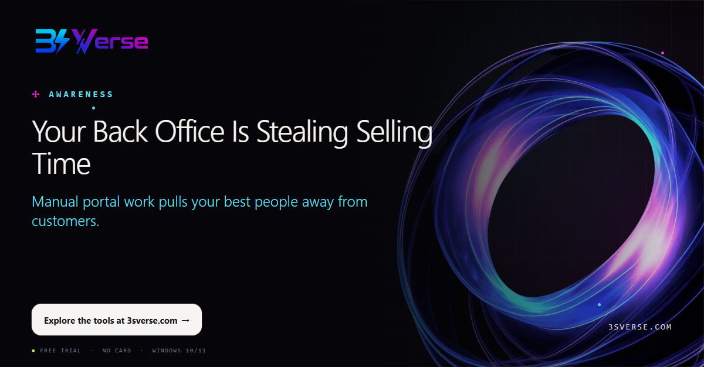

**Campaign stage:** Awareness & Pain  
**Creative hook:** Your Back Office Is Stealing Selling Time  
**CTA:** Explore the tools at 3sverse.com

VidaPay and Total Wireless retailers should not have to choose between serving customers and finishing repetitive back-office work. When reporting, ordering, and claims consume the day, selling time disappears. 3SVerse helps turn those repeatable workflows into guided, consistent processes—on the Windows PCs your team already uses.

Start by identifying the task your team repeats most. Then give that time back to the store.

#VidaPay #TotalWireless #WirelessRetail #RetailAutomation #DealerOperations

---

## Day 2 — Friday, October 2, 2026

**Campaign stage:** Awareness & Pain  
**Creative hook:** One Dealer Login. Too Many Repetitive Steps.  
**CTA:** See the workflow suite at 3sverse.com

VidaPay is central to daily operations, but extracting records, ordering devices, and filing rebates can still demand the same clicks again and again. 3SVerse adds a practical automation layer while your team continues working under its own authorized login.

Less repetition. More consistent execution. More time for customers.

#VidaPay #WirelessDealer #RetailOperations #WorkflowAutomation #3SVerse

---

## Day 3 — Saturday, October 3, 2026

**Campaign stage:** Awareness & Pain  
**Creative hook:** Multi-Store Growth Shouldn’t Multiply Admin  
**CTA:** Start a free trial

Every new location adds orders, claims, reporting, and follow-up. Without a repeatable system, growth can multiply administrative work faster than revenue. 3SVerse is designed for multi-store wireless dealer operations, helping teams apply the same workflow across locations while retaining store-level visibility.

Build the operating rhythm before the next location opens.

#MultiStoreRetail #TotalWireless #WirelessRetail #DealerOperations #RetailTech

---

## Day 4 — Sunday, October 4, 2026

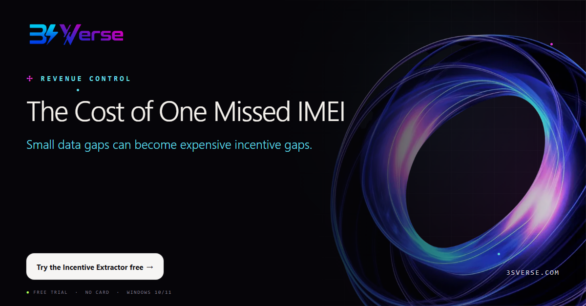

**Campaign stage:** Awareness & Pain  
**Creative hook:** The Cost of One Missed IMEI  
**CTA:** Try the Incentive Extractor free

A missed IMEI or incomplete incentive review can quietly reduce margin. The VidaPay Incentive Extractor helps dealers move portal data into a structured workbook and review performance at the transaction level.

Better visibility does not just save time—it supports better revenue control.

#VidaPay #IncentiveManagement #WirelessDealer #RetailAnalytics #3SVerse

---

## Day 5 — Monday, October 5, 2026

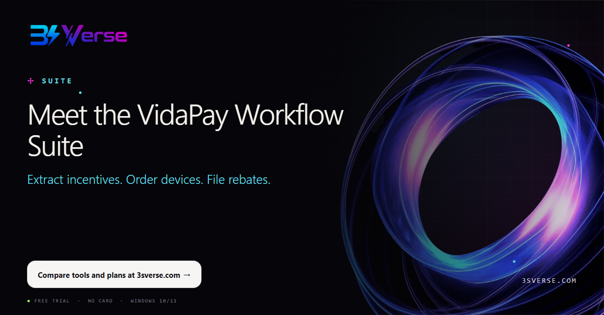

**Campaign stage:** Awareness & Pain  
**Creative hook:** Meet the VidaPay Workflow Suite  
**CTA:** Compare tools and plans at 3sverse.com

Three recurring VidaPay workflows, one focused toolkit for wireless retailers: Incentive Extractor, Device Ordering, and Rebate Filing. Use the tool that solves today’s bottleneck or choose the full bundle for a more consistent back office.

Built for practical daily use by VidaPay and Total Wireless dealer teams.

#VidaPay #TotalWireless #RetailAutomation #WirelessRetail #3SVerse

---

## Day 6 — Tuesday, October 6, 2026

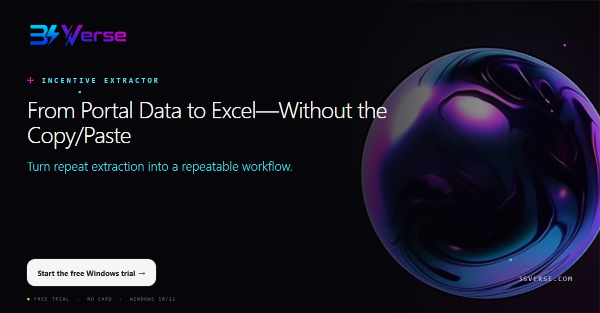

**Campaign stage:** Incentive Extractor  
**Creative hook:** From Portal Data to Excel—Without the Copy/Paste  
**CTA:** Start the free Windows trial

Copying portal records into spreadsheets is slow and easy to interrupt. The VidaPay Incentive Extractor organizes the workflow so dealer teams can produce usable Excel data with fewer manual steps.

Spend less time rebuilding reports and more time acting on what they show.

#VidaPay #ExcelAutomation #WirelessRetail #RetailReporting #DealerOperations

---

## Day 7 — Wednesday, October 7, 2026

**Campaign stage:** Incentive Extractor  
**Creative hook:** See Incentives at IMEI Level  
**CTA:** Explore Incentive Extractor

Store totals tell you what happened. IMEI-level detail helps you understand why. Give managers a clearer path to review incentive records, spot exceptions, and follow up with confidence.

Operational visibility is strongest when the underlying transactions are easy to inspect.

#IncentiveManagement #VidaPay #WirelessDealer #RetailAnalytics #3SVerse

---

## Day 8 — Thursday, October 8, 2026

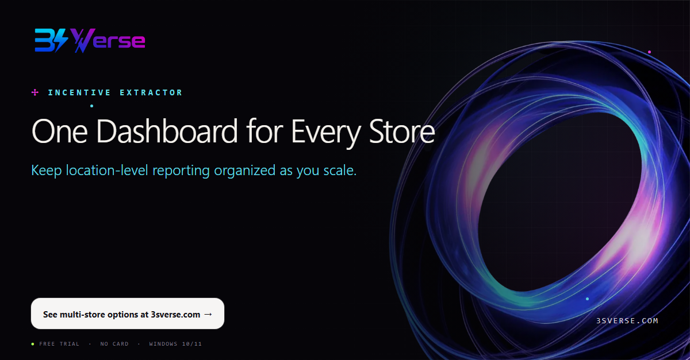

**Campaign stage:** Incentive Extractor  
**Creative hook:** One Dashboard for Every Store  
**CTA:** See multi-store options at 3sverse.com

Multi-store operators need a portfolio view without losing store-level accountability. 3SVerse helps organize VidaPay extraction across locations so results are easier to compare, review, and share.

A consistent report can become a consistent management habit.

#MultiStoreRetail #VidaPay #RetailReporting #WirelessRetail #Operations

---

## Day 9 — Friday, October 9, 2026

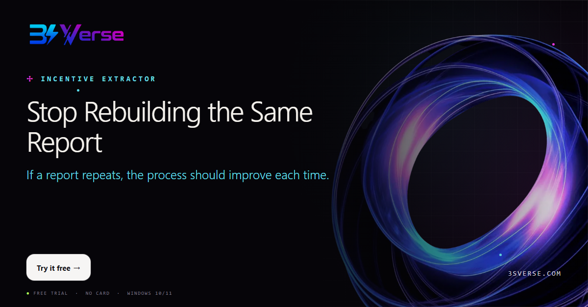

**Campaign stage:** Incentive Extractor  
**Creative hook:** Stop Rebuilding the Same Report  
**CTA:** Try it free

Weekly and monthly reporting should not start from zero. Standardize the extraction routine, reduce copy-and-paste work, and give your team an output they know how to use.

Repeatable work deserves a repeatable tool.

#WorkflowAutomation #VidaPay #WirelessDealer #RetailProductivity #3SVerse

---

## Day 10 — Saturday, October 10, 2026

**Campaign stage:** Incentive Extractor  
**Creative hook:** Your Data. Your Workflow. Your Decision.  
**CTA:** Start at 3sverse.com

The best way to evaluate automation is with the work your team already does. Install the VidaPay Incentive Extractor on Windows, run it under your own authorized login, and judge the time saved in your own stores.

The trial is free for 7 days and does not require a payment card.

#VidaPay #FreeTrial #WirelessRetail #RetailAutomation #3SVerse

---

## Day 11 — Sunday, October 11, 2026

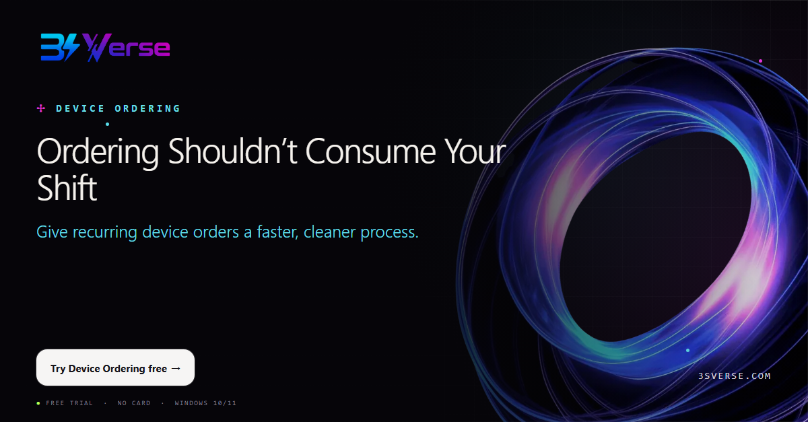

**Campaign stage:** Device Ordering  
**Creative hook:** Ordering Shouldn’t Consume Your Shift  
**CTA:** Try Device Ordering free

Device ordering is important—but repeated product selection and store-by-store entry can consume hours. 3SVerse Device Ordering guides the workflow so teams can prepare and submit orders more consistently across locations.

Make ordering day predictable again.

#DeviceOrdering #VidaPay #TotalWireless #InventoryManagement #WirelessRetail

---

## Day 12 — Monday, October 12, 2026

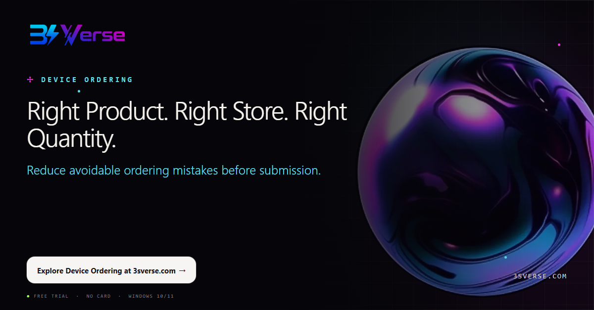

**Campaign stage:** Device Ordering  
**Creative hook:** Right Product. Right Store. Right Quantity.  
**CTA:** Explore Device Ordering at 3sverse.com

A clean order depends on three things: the correct product, the correct location, and the correct quantity. A guided workflow helps dealer teams review those choices before they become costly inventory problems.

Control starts before the order is placed.

#InventoryManagement #WirelessDealer #RetailOperations #VidaPay #3SVerse

---

## Day 13 — Tuesday, October 13, 2026

**Campaign stage:** Device Ordering  
**Creative hook:** One Guided Submit Across Branches  
**CTA:** See multi-store pricing

When each store uses a different process, ordering becomes harder to review and support. 3SVerse gives multi-store teams a consistent path for preparing device orders across branches while preserving location-level choices.

One routine is easier to teach, repeat, and improve.

#MultiStoreRetail #DeviceOrdering #TotalWireless #DealerOperations #RetailTech

---

## Day 14 — Wednesday, October 14, 2026

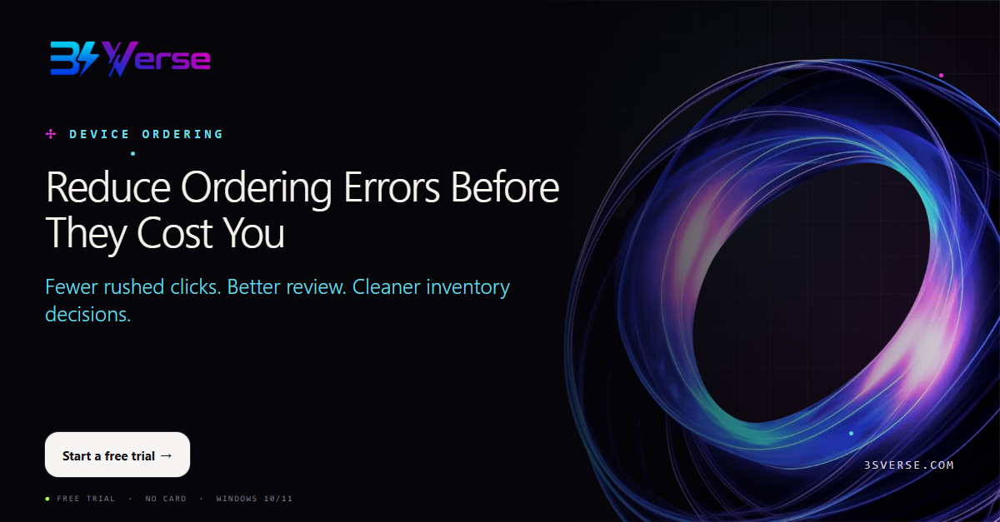

**Campaign stage:** Device Ordering  
**Creative hook:** Reduce Ordering Errors Before They Cost You  
**CTA:** Start a free trial

Ordering errors can create stock imbalances, tied-up cash, and avoidable transfers between stores. A structured workflow helps your team slow down at the right moments and move faster everywhere else.

Automation is valuable when it improves both speed and control.

#InventoryControl #VidaPay #WirelessRetail #RetailAutomation #3SVerse

---

## Day 15 — Thursday, October 15, 2026

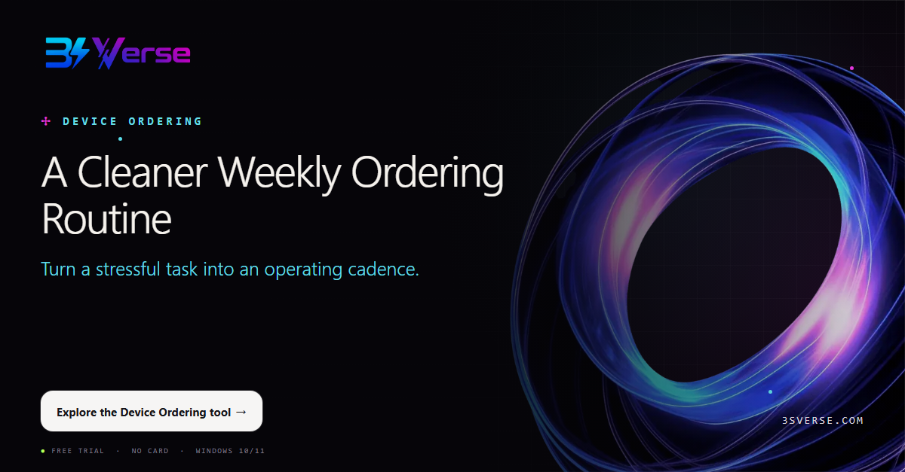

**Campaign stage:** Device Ordering  
**Creative hook:** A Cleaner Weekly Ordering Routine  
**CTA:** Explore the Device Ordering tool

The strongest dealer operations are built on routines teams can follow even during busy weeks. Standardize product selection, quantities, and store assignment so ordering becomes easier to execute and easier to review.

Consistency is a competitive advantage.

#RetailOperations #WirelessDealer #DeviceOrdering #ProcessImprovement #3SVerse

---

## Day 16 — Friday, October 16, 2026

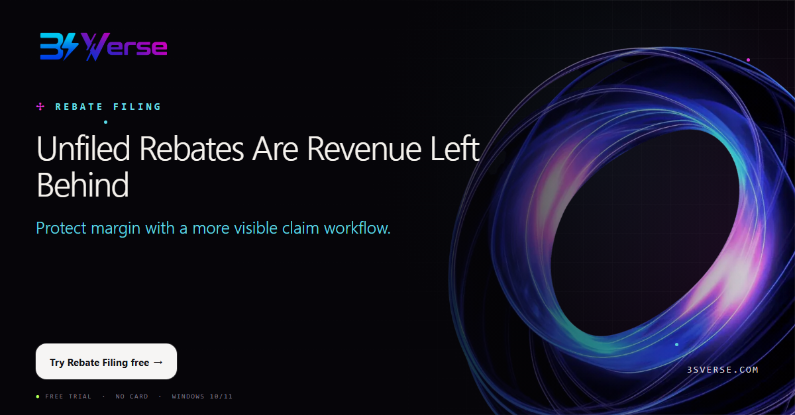

**Campaign stage:** Rebate Filing  
**Creative hook:** Unfiled Rebates Are Revenue Left Behind  
**CTA:** Try Rebate Filing free

A completed sale is not the end of the revenue cycle when a rebate still needs to be filed. 3SVerse Rebate Filing helps dealer teams work through eligible claims in a structured process and keep better visibility on status.

Make rebate follow-up part of the operating system—not a last-minute scramble.

#RebateManagement #VidaPay #TotalWireless #WirelessDealer #RevenueOperations

---

## Day 17 — Saturday, October 17, 2026

**Campaign stage:** Rebate Filing  
**Creative hook:** Bulk Claims Without Losing Claim-Level Visibility  
**CTA:** Explore Rebate Filing at 3sverse.com

Bulk work should not mean blind work. A better rebate process helps teams handle volume while preserving the ability to see what was filed, what failed, and what still needs attention.

Speed matters. So does traceability.

#RebateFiling #RetailAutomation #VidaPay #WirelessRetail #3SVerse

---

## Day 18 — Sunday, October 18, 2026

**Campaign stage:** Rebate Filing  
**Creative hook:** Know What’s Pending, Filed, Failed  
**CTA:** Start the free Windows trial

Claims become difficult to manage when status lives in memory, scattered notes, or multiple tabs. Use a consistent view of pending, completed, and failed work so the next action is clear.

Good operations make exceptions visible early.

#RebateManagement #DealerOperations #TotalWireless #WorkflowAutomation #3SVerse

---

## Day 19 — Monday, October 19, 2026

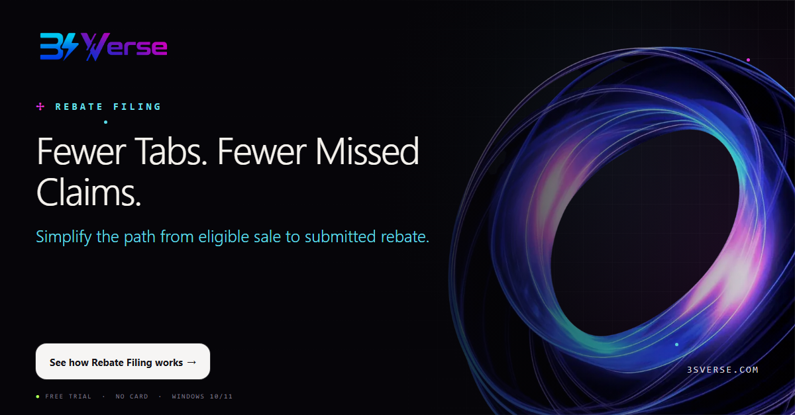

**Campaign stage:** Rebate Filing  
**Creative hook:** Fewer Tabs. Fewer Missed Claims.  
**CTA:** See how Rebate Filing works

Constantly switching between tabs and records increases fatigue and the chance that an eligible claim is overlooked. A guided filing workflow reduces that friction and helps staff stay focused on completion.

Protect attention—and protect earned revenue.

#RetailProductivity #RebateFiling #VidaPay #WirelessDealer #3SVerse

---

## Day 20 — Tuesday, October 20, 2026

**Campaign stage:** Rebate Filing  
**Creative hook:** Turn Rebate Work Into a Repeatable Process  
**CTA:** Try it free

Rebate filing should not depend on one employee remembering every step. Create a routine that can be taught, tracked, and repeated across your stores. 3SVerse helps turn a recurring burden into a clearer operational process.

Systems scale. Memory does not.

#ProcessImprovement #RebateManagement #MultiStoreRetail #WirelessRetail #3SVerse

---

## Day 21 — Wednesday, October 21, 2026

**Campaign stage:** Trust & Support  
**Creative hook:** Your Credentials Stay on Your PC  
**CTA:** Read the security approach at 3sverse.com

Retailers need efficiency without casually moving sensitive workflow data into another cloud. 3SVerse tools run on your Windows PC under your own authorized VidaPay login, with operational data kept locally.

You stay in control of the machine, the login, and the workflow.

#DataPrivacy #VidaPay #RetailTechnology #WirelessDealer #3SVerse

---

## Day 22 — Thursday, October 22, 2026

**Campaign stage:** Trust & Support  
**Creative hook:** Built for Windows 10 & 11  
**CTA:** Download the free trial

Adoption is easier when a tool fits the existing environment. 3SVerse desktop tools are built for Windows 10 and 11, helping dealer teams improve back-office workflows without replacing their store technology stack.

Practical software should meet operators where they work.

#WindowsSoftware #WirelessRetail #RetailAutomation #DealerOperations #3SVerse

---

## Day 23 — Friday, October 23, 2026

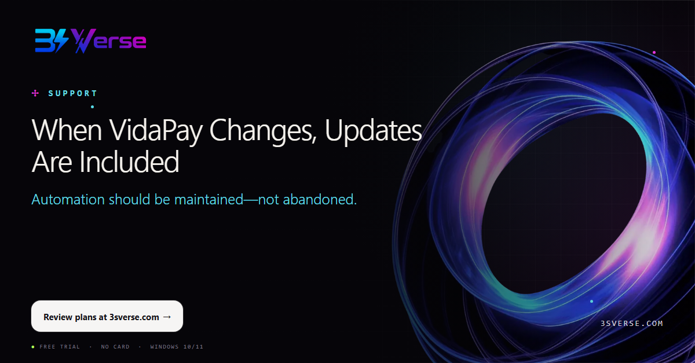

**Campaign stage:** Trust & Support  
**Creative hook:** When VidaPay Changes, Updates Are Included  
**CTA:** Review plans at 3sverse.com

Portal workflows evolve. The software supporting them needs to evolve too. Active 3SVerse licenses include updates, helping retailers stay aligned as supported workflows change. Same-day support is available when your team needs help.

A tool is only useful when it keeps working in the real world.

#VidaPay #SoftwareSupport #WirelessDealer #RetailTech #3SVerse

---

## Day 24 — Saturday, October 24, 2026

**Campaign stage:** Trust & Support  
**Creative hook:** Built by Operators, Not Outsiders  
**CTA:** Meet the toolkit at 3sverse.com

The best workflow tools start with the details operators notice: repeated clicks, missed follow-up, inconsistent store processes, and hours lost to routine admin. 3SVerse focuses on those practical dealer pain points.

Independent software, built for VidaPay and Total Wireless retail workflows.

#WirelessRetail #TotalWireless #DealerOperations #RetailAutomation #3SVerse

---

## Day 25 — Sunday, October 25, 2026

**Campaign stage:** ROI & Scale  
**Creative hook:** What Is One Admin Hour Worth Across 5 Stores?  
**CTA:** Run your own time-saving test

One repetitive task may look small. Multiply it by five stores, several employees, and every week of the year—and the cost becomes visible. Automation creates leverage by returning those hours to sales, coaching, inventory, and customer service.

Measure the task once. Then calculate what repetition is costing you.

#RetailROI #MultiStoreRetail #WirelessDealer #Operations #3SVerse

---

## Day 26 — Monday, October 26, 2026

**Campaign stage:** ROI & Scale  
**Creative hook:** Multi-PC Discounts for Growing Dealer Groups  
**CTA:** View multi-PC options at 3sverse.com

Standardization works best when the right team members have access. 3SVerse offers volume discounts for multiple PCs: 10% for 2–4, 20% for 5–9, and custom pricing for 10 or more.

Create one operating standard across the dealer group.

#MultiStoreRetail #WirelessDealer #RetailTechnology #DealerOperations #3SVerse

---

## Day 27 — Tuesday, October 27, 2026

**Campaign stage:** ROI & Scale  
**Creative hook:** Monthly, Annual, or Lifetime—Choose Your Fit  
**CTA:** Compare current plans at 3sverse.com

Some retailers want the flexibility of monthly software. Others prefer annual planning or a lifetime license. 3SVerse offers multiple ways to adopt individual tools or the full bundle, so dealers can choose the fit that matches their business.

Start with the workflow creating the most friction today.

#RetailSoftware #VidaPay #WirelessRetail #BusinessTools #3SVerse

---

## Day 28 — Wednesday, October 28, 2026

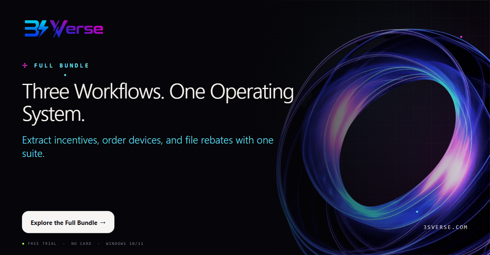

**Campaign stage:** Conversion  
**Creative hook:** Three Workflows. One Operating System.  
**CTA:** Explore the Full Bundle

Back-office improvement is strongest when the workflows support one another. The 3SVerse Full Bundle brings together Incentive Extractor, Device Ordering, and Rebate Filing for VidaPay and Total Wireless dealer teams.

One toolkit. Three recurring pain points. A more consistent operation.

#VidaPay #TotalWireless #RetailAutomation #WirelessDealer #3SVerse

---

## Day 29 — Thursday, October 29, 2026

**Campaign stage:** Conversion  
**Creative hook:** Money-Back Confidence  
**CTA:** Review the guarantee and plans

Software should earn its place in your operation. Alongside the free 7-day trial, eligible 3SVerse purchases include a 30-day money-back guarantee. Test the tools against real workflows and make the decision with evidence.

No inflated promises—just a practical opportunity to measure the fit.

#RetailTechnology #WirelessDealer #SoftwareTrial #Operations #3SVerse

---

## Day 30 — Friday, October 30, 2026

**Campaign stage:** Conversion  
**Creative hook:** Start Your Free Trial  
**CTA:** Start now at 3sverse.com

For VidaPay and Total Wireless retailers, repetitive admin is not just inconvenient—it limits focus, consistency, and growth. Choose Incentive Extractor, Device Ordering, Rebate Filing, or the Full Bundle and test it in your real operation.

Windows 10/11. No card required. Your login. Your PC. Your decision.

#VidaPay #TotalWireless #WirelessRetail #RetailAutomation #3SVerse

---

